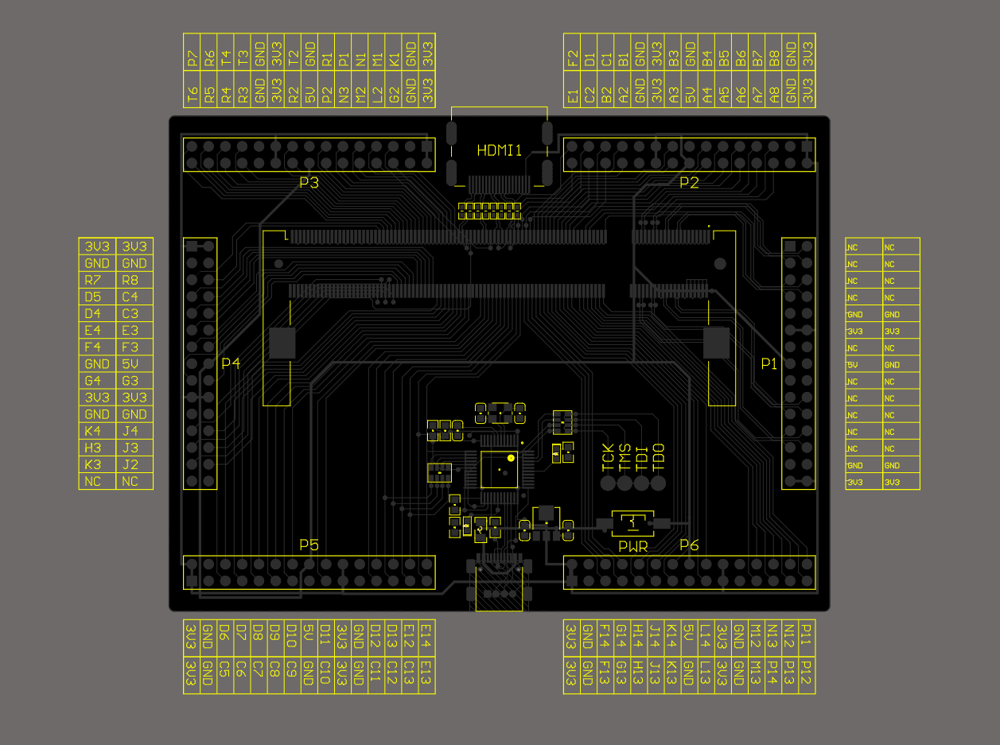
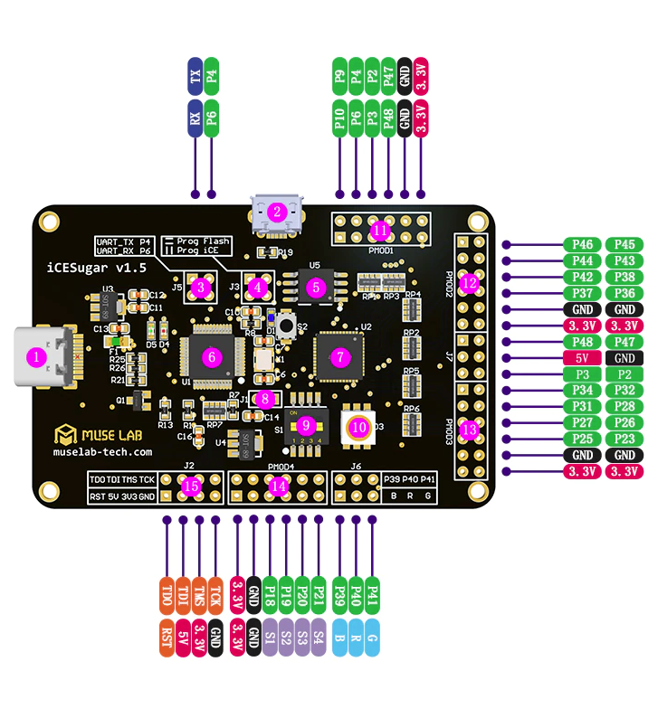
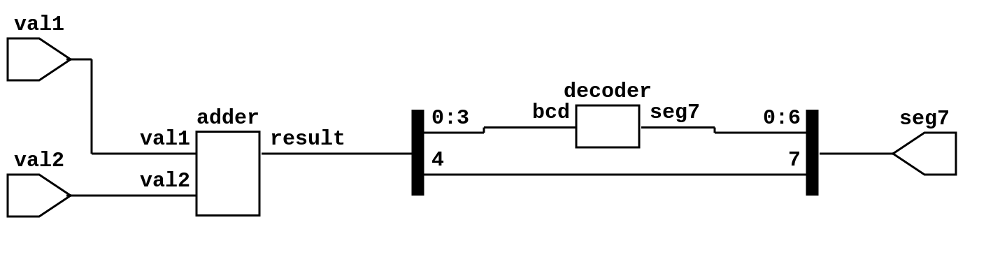

# Lab Week 02 Monday/Tuesday
This lab, we will be adding to your decoder from lab 2 in order to create a 4 bit adder that displays the result on a 7 segment display. We will also be going over how to set up the constraint file in order to correctly connect to your FPGA's IO and create a bitstream that can be loaded onto your FPGA.

### Required components
1. FPGA (either ICESuger or ICESuger-pro)
2. 7 segment display (with a 220 Ohm resistor for the common pin)
3. DIP switches (total of 8 switches will be used)
4. Enough wires to connect everything

### Wiring
#### 7 Segment Display
The 7-segment display will have all 8 LEDs(a-g and dec) connect to the FPGA (Read bellow about the constraints file for the specific FPGA you are using to determine where exactly to connect the wires). The common pin(assuming common cathode if you are using the one from th CS/EE120B lab kit), should connect to ground with the 220 Ohm ressistor

#### DIP Switches
We will need a total of 8 switches for this lab. One side of each switch will connect to the FPGA(Read bellow about the constraints file for the specific FPGA you are using to determine where exactly to connect the wires). The other side will connect to either 3V or ground deppending on which FPGA you are using. The **ICESugar-pro** deafults to pulldown inputs so the other side of the switches should connect to 3V. The regular **ICESugar** defaults to pullup inputs so the other side of the switches should connect to ground.

## Exercise 1: Synthesize decoder
At this point, you should have thoroughly tested your decoder module from lab 2. In this exercise, we will go over how to create a constraints file for the FPGA you are using in order to create the bitstream used to actually program it. 

The constraint files for the **ICESugar** and the **ICESugar-pro** are actually different. The ICESugar uses a `.pcf` file while the Pro uses a `.lpf` file. Although the files have different extensions, the idea is the similar.

The first thing you need to do before making your constraints file is decide where each wire will be connected. Each FPGA has something called Peripheral Modules or Pmods for short. These are the I/O interfaces for the FPGAs. You will need to take a look at your FPGA's pinout and decide which Pmods and pins on the Pmods you will be connecting your 7-segment display and switches

### ICESugar-pro `lpf` file
The **ICESugar-pro** has 6 Pmods but Pmod 1 is entirely made up of `gnd`, `3V` and `nc` pins so you can't actually use it for inputs or outputs. Use the following pinout of the ICESugar-pro to figure out where you will wire your switches and 7-segment display.



Once you know where everything will be wired, we can start writing the `.lpf` file. You will have to tell it where each individual bit of each input and output is connected. To do this, you first tell it which pin a bit in the design will use. This is done with  the line `LOCATE COMP "signal" SITE "pin";`. You will replace `signal` with the name of the signal from your top module, and `pin` with the pin name from the pinout above. After that, you will need to tell it if it is input or output. You will use `INPUT PORT "signal" IO_TYPE=LVCMOS33;` for input or `IOBUF PORT "signal" IO_TYPE=LVCMOS33;` for output. You will have to do this for every bit, meaning that there will be 2 lines in the `.lpf` file for each input and output bit. 

#### Example for 1 input and 1 output
```
// inputs
LOCATE COMP "val1[0]" SITE "D9";
INPUT PORT "val1[0]" IO_TYPE=LVCMOS33;

// outputs
LOCATE COMP "seg7[6]" SITE "C5"; // A
IOBUF PORT "seg7[0]" IO_TYPE=LVCMOS33;
```
### ICESugar `pcf` file
The **ICESugar** has 4 smaller sized Pmods. It is also labeled directly on it with what each pin is so you can see what each pin is easier.



Once you have decided where everything will be wired, you can start writing your `pcf` file. This is easier to do than the `lpf` files that the ICESugar-pro uses. For the ICESugar, all you need to do is tell it which pin is connected to what signal using the line `set_io signal 36`. You will replace `signal` with the name of the signal from your top module. When looking at the pinout, you will see each IO pin has a 'P' followed by a number. In the `pcf` file, you do not need to include the 'P'. You also do not need to specify if a pin is input or output. It will figure it out on its own.

#### Example for 1 input and 1 output
```
set_io val1[0] 36  

set_io seg7[0] 23 
```

### Synthesizing 
After you have created your constraints file for the 4 input switches and 7 leds on the 7-segment display, you can make the bitstream for your FPGA. If you are using the **ICESugar-pro**, you should run `make top.bit`, which will make the top.bit file inside of your build directory. If you are using the **ICESugar**, you should run `make top.bin`, to make the top.bin file in your build directory. If those commands run without error, you should be able to flash your FPGA the same way we did it in lab 1(If you are using the regular ICESugar, you will need to use `top.bin` instead of `top.bit`). 

If done corectly, the 4 switches used as input should be able to set the binary value that will then be displayed in hex on the 7-segment display.

## Exercise 2: 4 bit adder
For this exercise,you will make the 4 bit adder. Up to now, you have done everything in a single SystemVerilog file called `top.sv`. It is common to have a file for each module used and then connect them in the `top.sv`. To create the adder, we will have 3 files in our `src` directory. 

### decoder.sv
The first will be `decoder.sv`. For this file, you can take the contents you had in your `top.sv` from the previous lab and move it into `decoder.sv`. Then you will have to change the module name (inside `decoder.sv`) from "top" to something else. A good idea is to give the module the same name as the file. This makes it easier to find the code for specific modules when you have a lot of files.

### adder.sv
Next, we will create the `adder.sv` file. In this file, you will create a module that takes two 4 bit inputs and stores their sum into a 5 bit output.
#### Module Input
```verilog
input wire [3:0] val1,
input wire [3:0] val2,
```
#### Module Output
```verilog
output logic [4:0] res
```
### top.sv
In `top.sv`, you will make the `top` module that uses the previous 2 modules in order to create a 4 bit adder that displays the result on a 7 segment display. 

#### System Input
```verilog
    input wire [3:0] val1,
    input wire [3:0] val2,
```
#### System Output
```verilog
    output logic [7:0] seg7
```
In order to be able to use the other modules you have created,you will need to include them at the top of `top.sv`. To do this you will need to add the following to the top of the file:
```verilog
`include "src/decoder.sv"
`include "src/adder.sv"
```

Something you might have noticed is that the decoder from lab 2 takes a 4 bit value as input but the result of the adder is 5 bits. This is because the fifth bit will show if there is overflow and this will be displayed on the decimal point of the 7 segment display. This is also why the entire system's output is 8 bits instead of 7 like the decoder. In verilog, you are able to select specific bits using square brackets`[]`. You will need to use this in order to connect the correct bits to the inputs and outputs.
> example: `res[3:0]` selects the bottom 4 bits of 5 bit value `res`

#### System Schematic



Once you have created the system described in this part, create a testbench that tests various inputs. You do not need to test every single possible input. You only need to test enough to show that your design works. 

## Exercise 3: Synthesize 4 bit Adder
You will now need to upadate your constraints file from exercise 1 to include 4 more inputs for the second value and the output for the decimal point. After that, synthesize the new design and flash it to your FPGA. If done correctly, you will have a 4 bit adder on your FPGA where 4 switches control the first value and the other 4 switches will control the second value. The result should be display in hex on the 7 segment display and the decimal point will show if there is overflow.

## Submission
You do not need to clone this repo. You can just continue in your repo from lab 2, for this lab. When it is time to submit, push your code to your repo and then submit on gradescope, using your github repo.

### Lab Due Date
The Last time you will be able to demo this lab is the last office hours of the day the following Monday(4/13/2026). You will **NOT** be allowed to demo in Lab that day(or the following day if you section is on Tuesday).